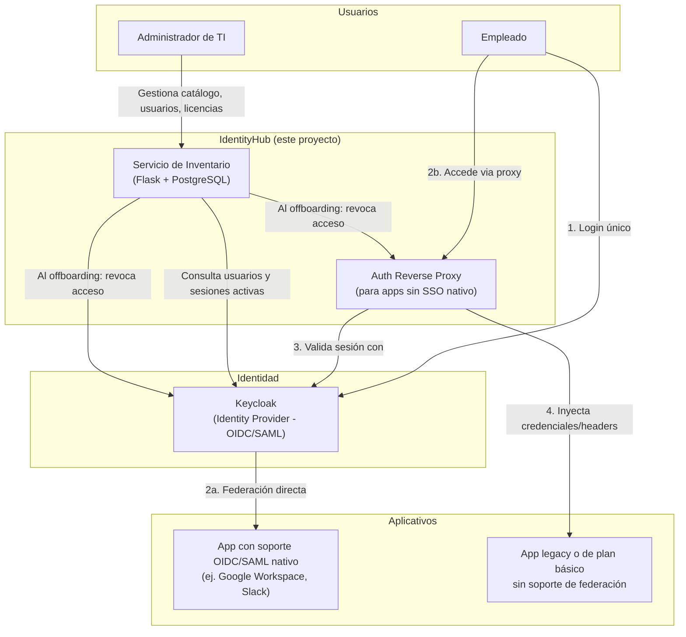

# Arquitectura de IdentityHub

## Componentes

## Por qué esta arquitectura (y no otra)

**Decisión 1 — No reinventar los protocolos de autenticación.**
Keycloak ya implementa OIDC y SAML de forma correcta y auditada por la comunidad de seguridad.
Escribir un proveedor de identidad propio sería un riesgo de seguridad innecesario y no aporta
valor académico real: el conocimiento técnico está en *orquestar* identidad, no en reimplementar
criptografía de sesión.

**Decisión 2 — El proxy de autenticación es la pieza que resuelve el problema real.**
La mayoría de plataformas de identidad (Okta, Azure AD) asumen que la aplicación protegida ya
habla SAML/OIDC. El problema que describe el equipo —aplicativos sin soporte nativo de SSO— no lo
resuelve un IdP por sí solo. Se necesita un componente intermedio (patrón *auth reverse proxy*)
que intercepte el tráfico, autentique contra Keycloak, y le pase la sesión a la aplicación protegida
sin que esta necesite ningún cambio en su código.

**Decisión 3 — El inventario es la capa de valor de negocio.**
Un IdP le dice "quién inició sesión". No le dice a un administrador "qué aplicativos existen en la
empresa, quién tiene acceso a cada uno, cuáles licencias se pagan sin usarse, y si a un exempleado
ya se le revocó todo". Esa capa de gestión —construida sobre la API de administración de Keycloak—
es la funcionalidad que un IdP comercial no resuelve de fábrica y donde está el aporte real del
proyecto.

## Modelo de datos inicial (servicio de inventario)

| Tabla | Campos principales | Propósito |
|---|---|---|
| `aplicativos` | id, nombre, tipo_soporte_sso (nativo / proxy / ninguno), costo_licencia_mensual | Catálogo de software de la empresa |
| `usuarios` | id, nombre, correo, keycloak_id, estado (activo/offboarding/inactivo) | Espejo de los usuarios gestionados en Keycloak |
| `accesos` | usuario_id, aplicativo_id, fecha_otorgado, fecha_revocado | Quién tiene acceso a qué, con historial |
| `eventos_offboarding` | usuario_id, fecha, aplicativos_revocados, responsable | Auditoría de qué se revocó y cuándo |

## Flujo crítico: offboarding centralizado

1. El administrador marca a un usuario como "Offboarding" en el servicio de inventario.
2. El servicio consulta la tabla `accesos` para saber a qué aplicativos tiene acceso ese usuario.
3. Para aplicativos federados vía Keycloak: se desactiva la cuenta directamente en Keycloak
   (API de administración), lo que invalida su sesión en todas las apps con SSO nativo.
4. Para aplicativos detrás del auth proxy: se invalida su sesión en el proxy.
5. Se registra el evento completo en `eventos_offboarding` como evidencia de auditoría.

Este es el flujo que se debe demostrar funcionando en el segundo/tercer corte — es la
funcionalidad de mayor impacto de seguridad real del proyecto.
