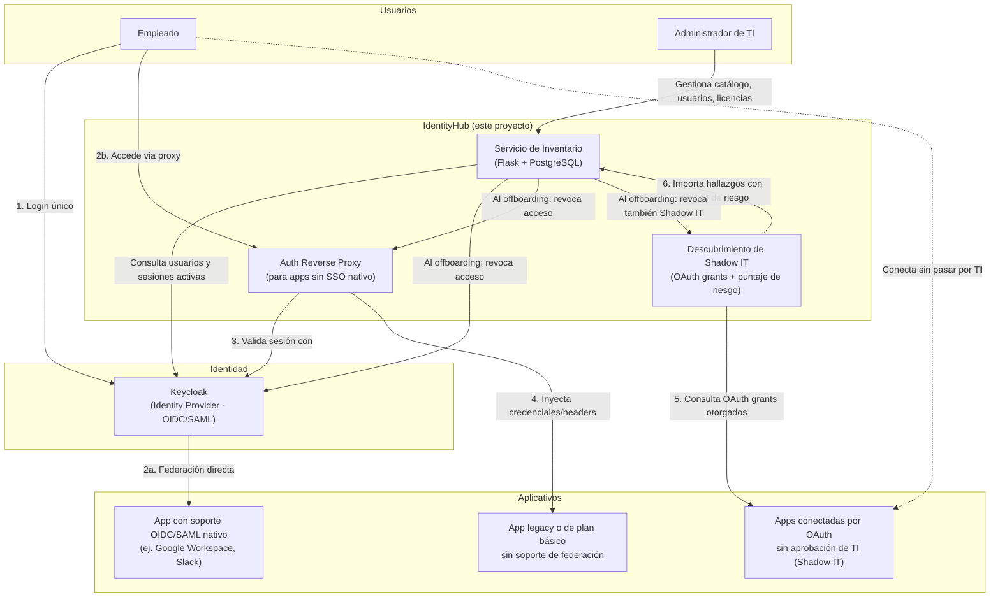

# Arquitectura de IdentityHub

## Componentes



## Por qué esta arquitectura (y no otra)

**Decisión 1 — No reinventar los protocolos de autenticación.**
Keycloak ya implementa OIDC y SAML de forma correcta y auditada por la comunidad de seguridad.
Escribir un proveedor de identidad propio sería un riesgo de seguridad innecesario y no aporta
valor académico real: el conocimiento técnico está en *orquestar* identidad, no en reimplementar
criptografía de sesión.

**Decisión 2 — El proxy de autenticación es la pieza que resuelve el problema real.**
La mayoría de plataformas de identidad (Okta, Azure AD) asumen que la aplicación protegida ya
habla SAML/OIDC. El problema que describe el equipo —aplicativos sin soporte nativo de SSO— no lo
resuelve un IdP por sí solo. Se necesita un componente intermedio (patrón *auth reverse proxy*)
que intercepte el tráfico, autentique contra Keycloak, y le pase la sesión a la aplicación protegida
sin que esta necesite ningún cambio en su código.

### Implementación del auth reverse proxy (`auth-proxy/`)

Ya tiene código funcional, no solo diseño. Flujo real:

1. El usuario entra a `auth-proxy` intentando llegar al aplicativo legacy protegido.
2. Si no tiene sesión, se le redirige a `/login`, que inicia el flujo OIDC estándar contra
   Keycloak (vía [Authlib](https://authlib.org/) — no se reimplementa el protocolo, ver Decisión 1).
3. Tras el login exitoso en Keycloak, `auth-proxy` guarda una sesión local con el email/nombre
   del usuario real.
4. En cada petición siguiente, el proxy la reenvía al aplicativo legacy (`legacy-app-demo/` en
   este esqueleto) inyectando:
   - Un header `X-Forwarded-User` con el usuario real, para trazabilidad/auditoría.
   - Las credenciales de una **cuenta de servicio compartida** (HTTP Basic Auth) que el
     aplicativo legacy sí entiende — el usuario final nunca ve ni conoce esa credencial.

**Probado end-to-end** (sin necesitar Keycloak real): se simuló una sesión ya autenticada y se
confirmó que el proxy bloquea sin sesión, inyecta correctamente la credencial de servicio hacia
el backend, y el backend legacy —que solo entiende Basic Auth y nunca fue modificado— responde
correctamente identificando al usuario real vía el header.

**Pendiente de verificar por el equipo** (requiere Docker, no disponible en este entorno de
desarrollo): el flujo completo de login real contra Keycloak. `keycloak-realm/identityhub-realm.json`
se importa automáticamente al levantar `docker compose up`, con el cliente `auth-proxy` y un
usuario de prueba ya configurados (`ana.torres` / `identityhub123`), para que probar el login real
sea inmediato:

```bash
docker compose up -d
# Esperar a que Keycloak termine de arrancar (~30-60s)
# Abrir http://localhost:9000 en el navegador -> redirige a login de Keycloak
# Iniciar sesión con ana.torres / identityhub123
# Debe mostrar la respuesta del aplicativo legacy, identificando a ana.torres@empresa-ejemplo.com
```

**Decisión 3 — El inventario es la capa de valor de negocio.**
Un IdP le dice "quién inició sesión". No le dice a un administrador "qué aplicativos existen en la
empresa, quién tiene acceso a cada uno, cuáles licencias se pagan sin usarse, y si a un exempleado
ya se le revocó todo". Esa capa de gestión —construida sobre la API de administración de Keycloak—
es la funcionalidad que un IdP comercial no resuelve de fábrica y donde está el aporte real del
proyecto.

**Decisión 4 — Descubrimiento de Shadow IT: el diferencial real frente a la competencia.**
Existen herramientas SSPM (SaaS Security Posture Management, ej. GAT, DoControl) que descubren
aplicativos conectados por OAuth sin aprobación de TI, pero son de precio empresarial y viven
separadas de la gestión de SSO/inventario. Existen IdP accesibles (Keycloak) pero no hacen
descubrimiento. Ninguna solución conocida, accesible para PYMES, une ambas cosas: descubrir
automáticamente lo que TI no sabe que existe, calificarlo por riesgo, y revocarlo en el mismo
flujo de offboarding que ya cubre los aplicativos conocidos. Esa unificación es el aporte
diferencial de IdentityHub.

El mecanismo real, ya construido (ver sección siguiente), consulta los permisos OAuth
otorgados vía Microsoft Graph API — la plataforma confirmada de la empresa de origen es
Microsoft Entra ID. Entra expone esta información en su consola de administración
(Identity → Applications → Enterprise applications → Consentimiento y permisos), pero sin una
forma accesible de vincularla con la gestión de accesos y el offboarding — ahí está el aporte.

## Modelo de datos (servicio de inventario)

| Tabla | Campos principales | Propósito |
|---|---|---|
| `aplicativos` | id, nombre, tipo_soporte_sso (nativo / proxy / ninguno), costo_licencia_mensual, **origen** (manual / oauth_discovery), **alcance_oauth**, **fecha_ultimo_uso**, **puntaje_riesgo** | Catálogo de software de la empresa, incluidos los descubiertos automáticamente |
| `usuarios` | id, nombre, correo, keycloak_id, estado (activo/offboarding/inactivo) | Espejo de los usuarios gestionados en Keycloak |
| `accesos` | usuario_id, aplicativo_id, fecha_otorgado, fecha_revocado | Quién tiene acceso a qué, con historial — no distingue origen manual/descubierto: el offboarding revoca ambos por igual |
| `eventos_offboarding` | usuario_id, fecha, aplicativos_revocados, responsable | Auditoría de qué se revocó y cuándo |

### Cálculo del puntaje de riesgo (Shadow IT)

Implementado en `calcular_puntaje_riesgo()` (`inventory-service/app.py`), basado en reglas
explicables (no un modelo de caja negra, para que sea defendible en la sustentación):

- **Alcance de permisos otorgado**: acceso amplio ("completo", "administrador") puntúa más alto
  que acceso de solo lectura.
- **Inactividad**: un token OAuth sin uso reciente puntúa más alto — es el patrón más citado en
  la investigación de shadow apps (cuentas de exempleados o apps abandonadas que nadie revocó).

Migrar esto a un modelo entrenado con datos reales de uso es una mejora natural para el tercer
corte, una vez el equipo tenga suficiente historial real de la empresa.

### Integración real con Microsoft Entra ID (plataforma confirmada)

Construida en `discovery-connectors/entra_id.py`. Autentica contra Microsoft Graph API (flujo
Client Credentials, sin usuario involucrado) y consulta `oauth2PermissionGrants` — las
concesiones OAuth reales del tenant — resolviendo el nombre de cada aplicativo vía
`servicePrincipals`. El resultado se envía a `/api/discovery/importar`, el mismo endpoint ya
construido y probado.

Requiere que un administrador de Entra ID de la empresa registre una aplicación con permiso
`Directory.Read.All` (de solo lectura) y otorgue *admin consent* — instrucciones paso a paso al
inicio del archivo `discovery-connectors/entra_id.py`.

**Limitación documentada, no oculta:** Microsoft Graph no expone la fecha de último uso
directamente en `oauth2PermissionGrants`. Obtenerla requiere correlacionar con
`auditLogs/signIns`, que puede necesitar licencia Entra ID P1/P2 según la retención de logs
deseada. Por ahora el conector importa `fecha_ultimo_uso=null`, que `calcular_puntaje_riesgo()`
ya trata como riesgo medio. Correlacionar con el log de inicios de sesión es una mejora natural
pendiente para un corte posterior, no un dato inventado para completar el actual.

**Probado con respuestas simuladas de Microsoft Graph** (estructura real documentada de la
API): el conector resuelve nombres de apps correctamente, deduplica cuando varios usuarios
otorgaron permisos a la misma app, y el formato enviado a `/api/discovery/importar` es
compatible. **Pendiente de que el equipo lo ejecute contra el tenant real** una vez configurada
la app registrada — no se probó contra Entra ID real porque este entorno de desarrollo no tiene
esas credenciales.

## Flujo crítico: offboarding centralizado

1. El administrador marca a un usuario como "Offboarding" en el servicio de inventario.
2. El servicio consulta la tabla `accesos` para saber a qué aplicativos tiene acceso ese usuario.
3. Para aplicativos federados vía Keycloak: se desactiva la cuenta directamente en Keycloak
   (API de administración), lo que invalida su sesión en todas las apps con SSO nativo.
4. Para aplicativos detrás del auth proxy: se invalida su sesión en el proxy.
5. Se registra el evento completo en `eventos_offboarding` como evidencia de auditoría.

Este es el flujo que se debe demostrar funcionando en el segundo/tercer corte — es la
funcionalidad de mayor impacto de seguridad real del proyecto.

## Costos y despliegue

Todo el software de este proyecto (Keycloak, PostgreSQL, Flask) es libre y de código abierto:
cero costo de licencia. El único punto de fricción real es que Keycloak, al ser una aplicación
Java, necesita más memoria que una app simple de Flask.

### Verificar los límites de memoria en su propia máquina (paso obligatorio antes de desplegar)

`docker-compose.yml` ya trae `mem_limit: 512m` en Keycloak y en el servicio de inventario —
el mismo límite que da el plan gratuito de Render por servicio. Esto permite probar localmente
si Keycloak arranca bien dentro de ese límite, **antes** de desplegar y descubrir un problema
en producción:

```bash
docker compose up
# Esperar a que Keycloak termine de arrancar (puede tardar 30-60 segundos, es normal)
# Si el contenedor de keycloak se reinicia solo o muere, revisar:
docker stats
docker logs <nombre-del-contenedor-keycloak>
```

Si ven errores de memoria (`OutOfMemoryError` o el contenedor muriendo sin razón aparente),
bajen el valor de `-Xmx` en la variable `JAVA_OPTS_APPEND` de `docker-compose.yml` (por ejemplo,
de `300m` a `250m`) y prueben de nuevo.

> Nota de transparencia: estos valores se configuraron siguiendo el comportamiento documentado
> de Keycloak (el heap de la JVM se calcula como un porcentaje de la memoria del contenedor
> desde la versión 24), pero no se pudieron probar en un entorno Docker real durante la
> preparación de este esqueleto. Verificarlo localmente es responsabilidad del equipo antes
> de la sustentación.

### Desplegar Keycloak en Render

Render permite desplegar una imagen Docker existente (como `quay.io/keycloak/keycloak`) como
Web Service desde su dashboard, sin necesidad de un Blueprint (`render.yaml`) para esa parte
específica — es el camino más confiable dado que no se pudo verificar la sintaxis exacta del
Blueprint para imágenes externas:

1. Render → New → Web Service → "Deploy an existing image from a registry".
2. Imagen: `quay.io/keycloak/keycloak:25.0`.
3. Variables de entorno: las mismas que están en `docker-compose.yml` para el servicio
   `keycloak` (`KEYCLOAK_ADMIN`, `KEYCLOAK_ADMIN_PASSWORD`, `KC_DB`, `KC_DB_URL`, etc.,
   más `JAVA_OPTS_APPEND` con los mismos límites de memoria).
4. Start Command: `start-dev` (modo desarrollo; para un ambiente más parecido a producción,
   revisar la documentación oficial de Keycloak sobre el modo `start`).
5. Plan: Free.

El servicio de inventario (`identityhub-inventory` en `render.yaml`) sí se puede desplegar
directamente como Blueprint, igual que en el proyecto anterior.

### Si 512 MB no alcanza

Si tras probar localmente Keycloak sigue sin caber cómodamente en 512 MB, la alternativa es
correr Keycloak localmente durante la sustentación (con capturas/video como evidencia adicional
en Drive) y desplegar solo el servicio de inventario en Render — sigue siendo una entrega válida.

